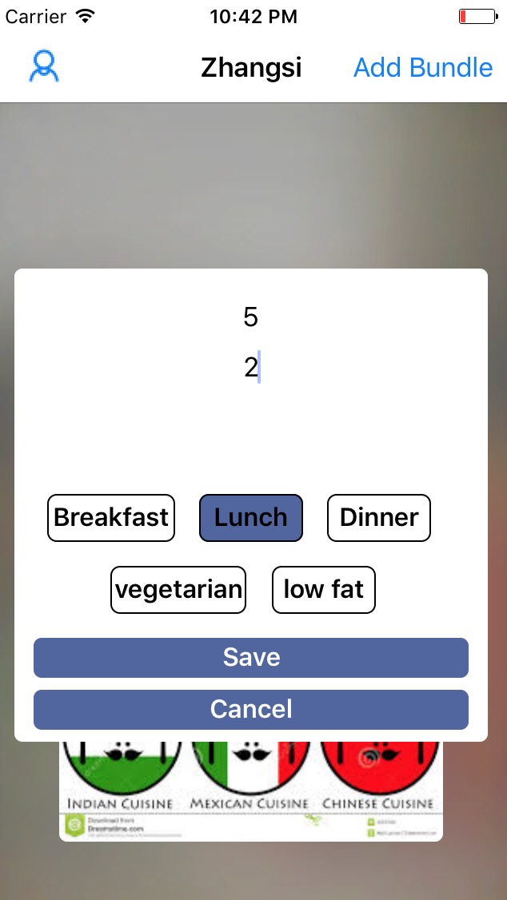
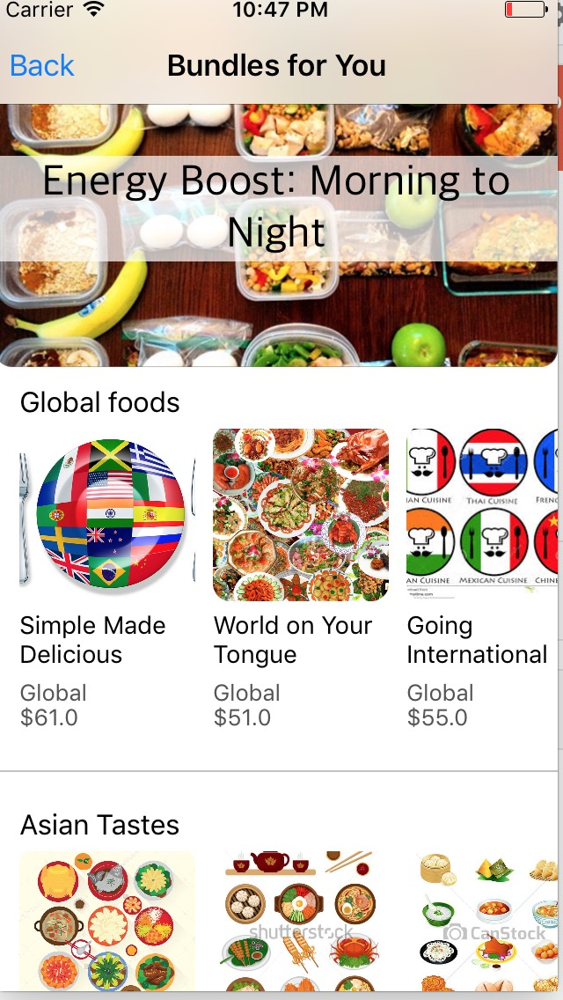
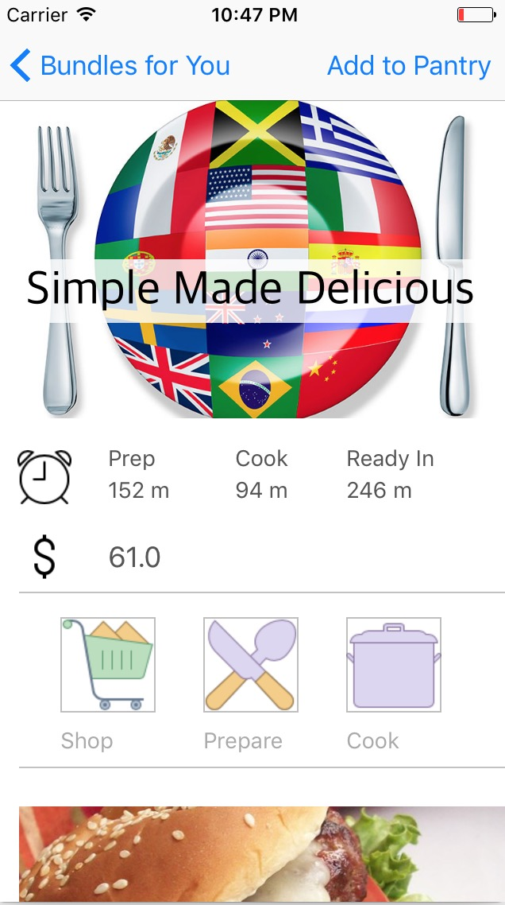
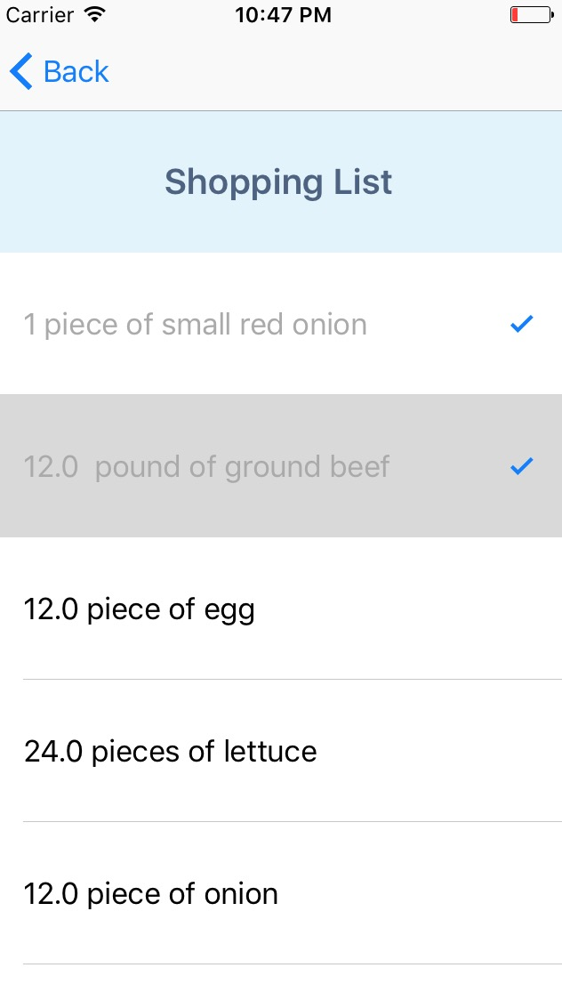
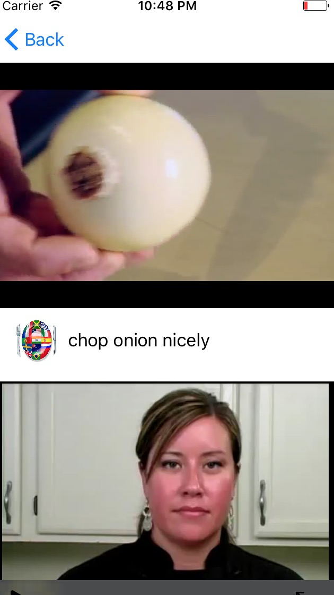
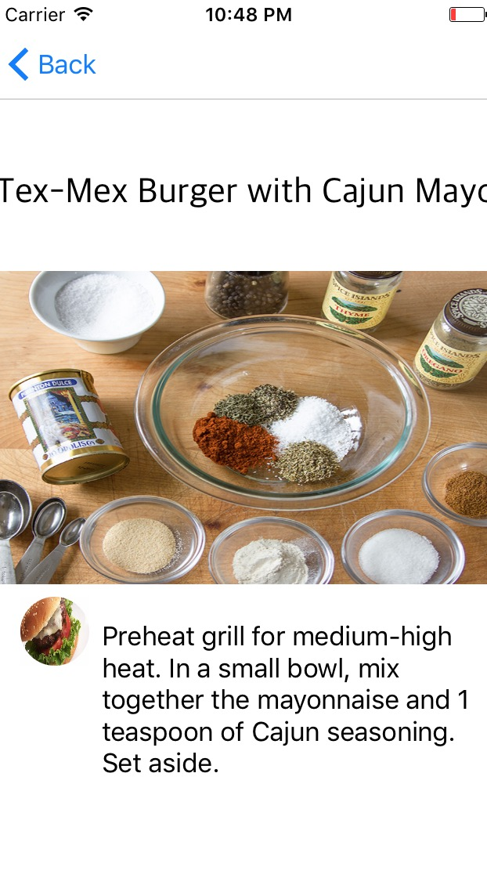
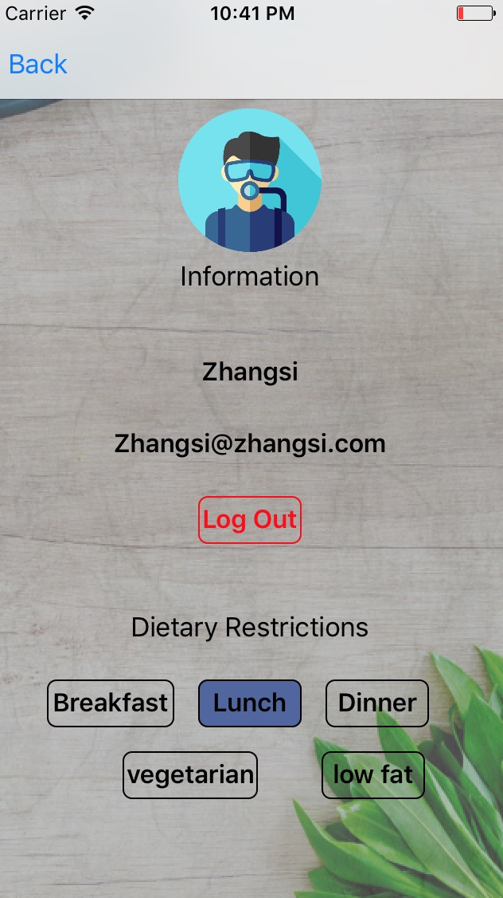

## User Guide

**Table of Contents**

1. Introduction  
2. Application Usage Overview  
3. User Login/Regiester
4. Bundle building
5. Bundle Selection
6. Bundle detail review 
7. Checkable shopping list 
8. Preparation videos
9. Recipe guides
10. User Account Information

**1.Introduction**

Bundled is an Apple ios online mobile application which intends to help users set up meal plans, generate grocery shopping lists and guide users to prepare meal at kitchen. After installing this Application, users will be able to:

- build the meal plan for any time range based on number of meals and their dietary restrictions;  
- access dish recipes from different regions on the world;  
- receive a checkable grocery shopping list for all the ingredients for the bundle;
- watch ingredients preparation videos on the mobile devices
- read the image and text guides step by step for recipes;

 
 

**2.Application Usage Overview**

Users can access several **Bundled** views by clicking the buttons on the top navigation bar.

- **Login & Registration** : user can login into the App by registered email address and password, or register personal information on our database if s/he is the first time use the App.
- **Add new Bundle/Access the last Bundle** : the user can build the new Bundle by input the number of people and meals s/he wants to prepare and activate/deactivate the dietary restrictions on the pop over view, or click the cover image of the Bundle to access the latest one s/he built. 
- **Bundle selection** : available Bundles are listed as different groups on this page.
- **Bundle detail review** : the dishes in the Bundle are list on the bottom on this page, and the user can go to shopping list, preparation videos, recipe guides views. 
- **Shopping List** : a list of required ingredients for the Bundle on this view.
- **Preparation** : the videos for preparation operations are listed on this view.
- **Recipes** : the image and text of recipe steps are listed on this view.
- **User Account** : the user profile information including email address, username and dietary restrictions.

 
 

**3.User Login/Register**

At the first time that a user run this App, s/he will be at the Login/Register view, where s/he can log on to the App by an registered email address and password, as on the left photo below. If s/he has not registered before, the user can click the "register button", and use an unregiestered email address to set up a new account, as on the right photo below. **password** must be longer than 8 digits

 
 

**4.Bundle Building**

After log on to the App, if the user has built bundle before, the cover image of the bundle will appear at the middle of the view, and the user can click the image to access the detail of the bundle. If the user does not build any bundle before, or if the user is not satisfied with the current bundle, s/he can click the "Add New Bundle" on the top right of the view, and can input the number of meals, the number of people and the dietary restrictions of the bundle to build a new Bundle, as in the image below. If the user click the "save" button, s/he will go to the bundle selection view.

 
 

**5.Bundle Selection**  

In this view, the user can see all the available Bundles, which are grouped by their regions. At the top of view, there are three featured bundles whose cover image is listed. Under the big pictures, there are four rows of cubic pictures. The user can click into any one of the cubic images to see the details of the Bundle.

 
 

**6.Bundle Details**    

In this view, the user can see the details of the Bundle s/he just clicked. The image at the top is the cover photo and the name of the Bundle. Below that, the cooking time, preparation time and total cost for all ingredients are listed. There are three buttons at the middle, and the user can access respective views by clicking them. A list of horizontally scorllable images and text labels is at the bottoms. These are the dishes contained in the Bundle. After the user is satisfied with the Bundle, s/he can click the "Add to Pantry" button at the top right corner to add the Bundle to home page, and the user will be back to home page . The Bundle s/he selected can be accessed at the home page by clicking the image.

**7.Shopping List**

By clicking the **Shopping** button, the user can access the shopping list of the Bundle. The items are checkable, which means the user can check the items s/he already bought.

**8.Paration**

By clicking the **Preparation** button, the user can access a list of the videos, which shows the preparation of the ingredients of the Bundle. The user can play/pause/full-screen the video.

**9.Recipes**

By clicking the **Recipe** button, the user can access a list of images and text, which shows all cooking steps of the dish.

**10.User Account Information**

In the home page of the App, there is a User Account button at the top left of the view. By clicking that, the user can access the user account information, including their login information and dietary restrictons.

 

